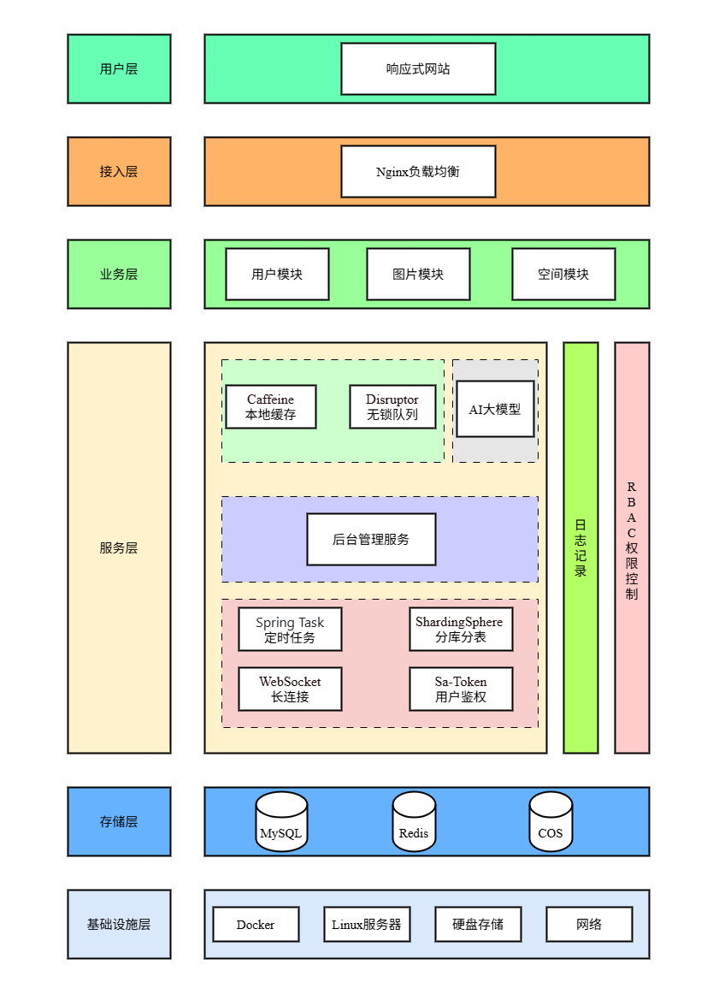

# 逸云智能协同云图库

# **项目介绍**

逸云智能协同云图库是一个基于 Spring Boot + Vue3 的图片素材网站，本项目是由程序员鱼皮的项目进行的二次开发，支持图片上传、分享、搜索、AI 扩图等功能。本系统采用前后端分离架构，提供 RESTful API 接口。

# **技术栈**

## 前端技术栈

- **核心框架**: Vue 3
- **开发语言**: TypeScript
- **状态管理**: Pinia
- **UI 框架**：Ant Design Vue (PC端)
- **路由**: Vue Router
- **HTTP 请求**: Axios
- **构建工具**: Vite
- **代码规范**: ESLint + Prettier+TypeScript
- **代码生成**：OpenAPI

## 后端技术栈

- **核心框架**：Spring Boot 
- **ORM 框架**：MyBatis Plus
- **关系型数据库**：MySQL 
- **缓存数据库**：Redis
- **实时通信**：WebSocket

## 中间件

- **接口文档**：knife4j
- **数据抓取**：Jsoup
- **并发和异步编程**：JUC 
- **高性能无锁队列**：Disruptor
- **权限控制**：Sa-Token 
- **本地缓存**：Caffeine
- **分库分表**：ShardingSphere 
- **工具库**：Lombok +Hutool 

## 第三方技术栈

- 腾讯云 COS 对象存储 - 图片文件存储
- 阿里云 AI 扩图服务 - 图片智能扩展
- 百度以图搜图 API - 相似图片搜索

# **系统架构**

# **核心功能**

1. 用户模块

   用户模块包含下列功能:

   - 用户注册：用户访问平台并点击注册按钮后，需填写如手机号、验证码、密码等注册信息，随后系统会对这些信息进行验证，涵盖手机号格式、验证码有效性、密码强度等方面。若信息验证通过，系统会将用户信息存入数据库，并为其分配唯一的用户 ID。注册成功后，系统将自动为用户登录，并跳转至平台首页或用户个人中心。
   - 用户登录：用户进入登录页面后，可选择如手机号密码登录、手机号验证码登录、邮箱号密码登录式或邮箱号验证码登录等登陆方式，接着输入相应的登录信息，系统会对这些信息进行验证。若验证通过，系统将为用户生成唯一的会话标识，用户登录成功并进入系统主页或上次退出的页面；若验证失败，系统会提示用户错误信息，此时用户可重新输入登录信息或选择其他登录方式。 
   - 获取当前登录用户：用户登录系统后，系统会验证用户身份并生成会话标识。在用户进行各类操作的过程中，系统需获取当前登录用户的信息，具体做法是依据用户的操作请求，从会话或数据库里提取该用户的相关信息，随后将这些获取到的用户信息用于业务逻辑处理、界面展示或其他相关操作。 
   - 用户退出：当用户发起退出请求后，系统将用户从系统中退出。 
   - 用户权限控制：用户又分为普通用户和管理员，管理员拥有整个系统的最高权
     限，比如可以管理其他用户。
   - 用户管理：仅管理员可用，可以对整个系统中的用户进行管理，包含创建用户，更新用户，删除用户，获取脱敏用户信息等功能。

2. 图片模块

   - 图片上传：管理员和用户可上传图片，并填写相关信息，如名称、简介、标签、分类等。管理员上传图片默认通过审核，但用户上传的图片需要管理员审核其内容。审核通过的图片会被系统自动解析基础信息(如宽高和格式等)，通过检索能展示在主页。
   - 图片修改：管理员可以对图片信息进行编辑，例如修改名称、简介、标、分类等。
   - 图片查看：用户在主页上可按关键词搜索图片，并支持按分类、标签等筛选条件分页查看图片列表。当用户点击列表中的图片后，可进入详情页，查看图片的大图及相关信息，如名称、简介、分类、标签、其他图片信息(如宽高和格式等)。
   - 图片下载：用户在详情页可点击下载图片按钮，将图片保存至本地。
   - 图片管理：管理员可以对图库内的图片资源进行管理，包括查询和删除。

3. 空间模块

   - 管理空间:仅管理员可用，可以对整个系统中的空间进行管理，比如搜索空间、编辑空间、删除空间。
   - 用户创建私有空间:用户可以创建 最多一个 私有空间，并且在私有空间内自由上传和管理图片。
   - 私有空间权限控制:用户仅能访问和管理自己的私有空间和其中的图片，私有空间的图片不会展示在公共图库，也不需要管理员审核。
   - 空间级别和限额控制:每个空间有不同的级别(如普通版和专业版)，对应了不同的容量和图片数量限制，如果超出限制则无法继续上传图片。

# **功能拓展**

1. 图片优化
   - 图片查询优化-多级缓存
   - 图片上传优化-压缩
   - 图片加载优化-缩略图
2. 图片功能拓展
   - 基础属性搜索：支持关键词（同时搜索名称和简介）、标签、分类、编辑时间(开始时间与结束时间)、图片名称、图片简介、图片宽度、图片高度、图片格式
   - 以图搜图：利用已有的以图搜图网站，通过数据抓取的方式实时查询搜图网站的返回结果。
   - 颜色搜索：能够按照颜色搜索空间内主色调最相似的图片
   - 图片分享：支持移动端扫码分享和复制链接分享
   - 图片批量管理：用户可以对私有空间内的图片进行批量修改，包括批量修改图片的标签和分类以及批量修改图片名称
3. AI图片编辑
   - 支持按固定比例或自由裁剪，提供顺时针、逆时针旋转功能
   - 利用阿里云百炼AI绘图大模型实现图片扩图
4. 图库分析
   - 用户空间图库分析：利用仪表盘展示空间资源使用，利用分组条形图展示空间图片分类，利用词云图展示空间图片标签，利用饼图展示空间图片大小，利用折线图展示用户上传行为
   - 管理员全空间分析：全统计公共图库、以及系统内所有空间的总存储量和总图片数，并且也支持任意空间的图片分类、图片标签、图片大小、用户上传行为的分析，便于管理员了解系统资源分配和利用情况。按存储使用量排序，统计占用存储最多的前 10个空间，帮助管理员快速定位高占用空间，并识别潜在的资源滥用或异常情况
5. 团队空间
   - 创建团队共享空间：用户可以创建 最多一个 团队共享空间，用于团队协作和资源共享，空间管理员拥有私有空间的所有能力，包括自由上传图片、检索图片、管理图片、分析空间等。
   - 空间成员管理：空间管理员可以邀请新成员加入团队，共享空间内的图片。
   - 空间成员权限控制:仅特定角色的成员可访问或操作团队空间内的图片。
6. 图片协同编辑
   - 在图片编辑的基础上增加了"协同" 的功能。当用户编辑某张图片时，其他用户可以实时看到编辑效果和操作提示。

# **总结与展望**

未来将持续迭代，重点聚焦以下方向：

1. **AI 能力深化**
   - 扩展 AI 图片处理场景（如自动标签生成、违规内容检测），降低人工审核成本。
   - 探索多模态搜索（图文混合检索），提升搜索精准度。
2. **移动端生态**
   - 开发原生移动端应用，优化移动端图片上传、分享及协同编辑体验。
3. **安全与扩展性**
   - 增强团队空间权限粒度（如文件夹级权限控制）
   - 支持多云存储切换，提升架构灵活性。

# **联系方式**

